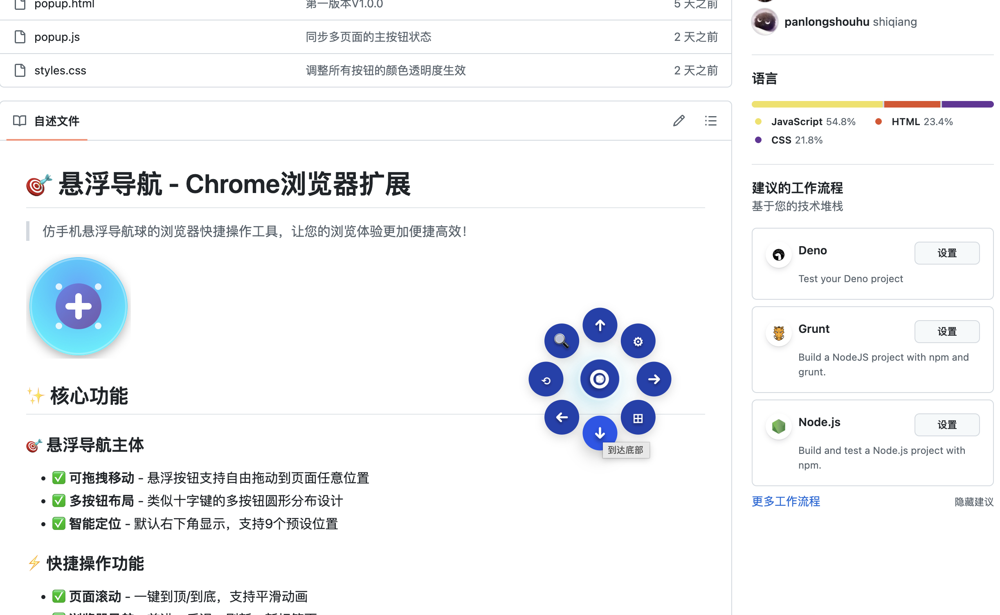
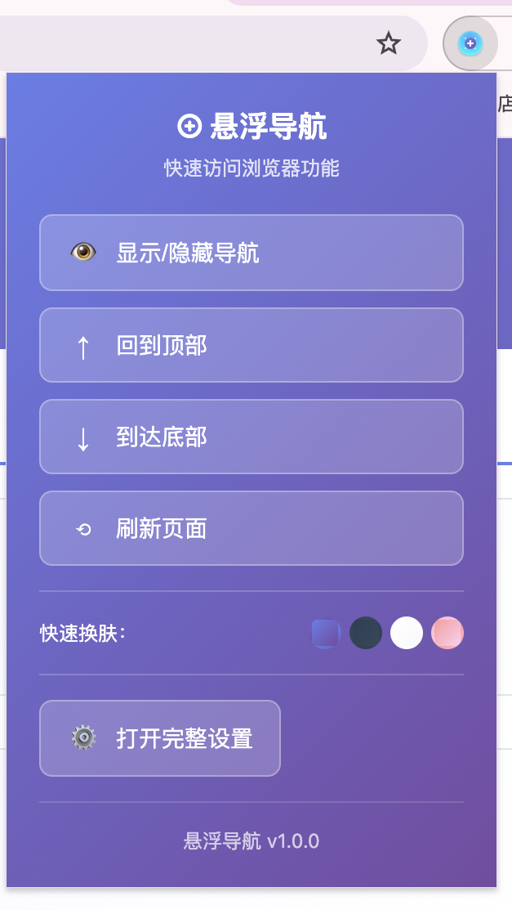

# 🎯 悬浮导航 - Chrome浏览器扩展

> 仿手机悬浮导航球的浏览器快捷操作工具，让您的浏览体验更加便捷高效！


## ✨ 截图实例
  

## ✨ 核心功能

### 🎯 悬浮导航主体
- ✅ **可拖拽移动** - 悬浮按钮支持自由拖动到页面任意位置
- ✅ **多按钮布局** - 类似十字键的多按钮圆形分布设计
- ✅ **智能定位** - 默认右下角显示，支持9个预设位置

### ⚡ 快捷操作功能
- ✅ **页面滚动** - 一键到顶/到底，支持平滑动画
- ✅ **浏览器导航** - 前进、后退、刷新、新标签页
- ✅ **书签管理** - 一键添加当前页面到书签
- ✅ **扩展设置** - 快速访问完整设置页面

### 🎨 动态换肤系统
- ✅ **多套主题** - 默认、暗色、亮色、彩虹、玻璃等主题
- ✅ **VIP主题** - 为高级主题预留付费升级接口
- ✅ **实时切换** - 无需刷新页面即可切换主题

### ⚙️ 设置系统
- ✅ **功能开关** - 自定义启用/禁用特定按钮
- ✅ **外观配置** - 按钮大小、标签显示、动画效果
- ✅ **位置设置** - 9宫格位置选择
- ✅ **数据管理** - 设置导入/导出、恢复默认

## 🚀 安装方法

### 方法一：开发者模式安装（推荐）

1. **下载源码**
   ```bash
   git clone https://github.com/panlongshouhu/BrowserFloatingNavigation.git
   cd BrowserFloatingNavigation
   ```

2. **准备图标文件**
   - 将 `icons/icon.svg` 转换为以下PNG格式：
     - `icons/icon16.png` (16x16像素)
     - `icons/icon48.png` (48x48像素)
     - `icons/icon128.png` (128x128像素)
   
   > 💡 可以使用在线SVG转PNG工具或Photoshop等软件进行转换

3. **加载扩展**
   - 打开Chrome浏览器
   - 地址栏输入 `chrome://extensions/`
   - 开启右上角"开发者模式"
   - 点击"加载已解压的扩展程序"
   - 选择项目文件夹

## 📖 使用指南

### 基础操作
1. **显示导航** - 安装后自动在页面右下角显示悬浮按钮
2. **展开菜单** - 点击主按钮展开功能菜单
3. **拖拽移动** - 长按主按钮可拖拽到任意位置
4. **功能使用** - 点击对应功能按钮执行操作


### 设置配置
- **右键扩展图标** → 选项 → 打开设置页面
- **点击⚙️按钮** → 打开设置页面
- **点击扩展图标** → 弹出快速操作面板

## 🎨 主题展示

| 主题名称 | 预览 | 描述 |
|---------|------|------|
| 默认主题 | 🔵 | 经典蓝紫渐变，适合大多数场景 |
| 暗色主题 | ⚫ | 深色商务风格，护眼低调 |
| 亮色主题 | ⚪ | 简洁明亮设计，清新简约 |
| 彩虹主题 | 🌈 | 炫彩渐变效果（VIP专享） |
| 玻璃主题 | 💎 | 毛玻璃透明效果（VIP专享） |

## 🛠️ 技术架构

### 文件结构
```
浏览器悬浮导航/
├── manifest.json          # 扩展配置文件
├── content.js             # 内容脚本（主要功能）
├── background.js          # 后台服务脚本
├── styles.css             # 样式文件
├── popup.html             # 弹窗页面
├── popup.js               # 弹窗脚本
├── options.html           # 设置页面
├── options.js             # 设置脚本
├── options.css            # 设置样式
├── icons/                 # 图标文件夹
│   ├── icon.svg          # 矢量图标
│   ├── icon16.png        # 16x16图标
│   ├── icon48.png        # 48x48图标
│   └── icon128.png       # 128x128图标
└── README.md             # 说明文档
```

### 技术特色
- ✅ **Manifest V3** - 采用最新Chrome扩展标准
- ✅ **模块化设计** - 代码结构清晰，易于维护扩展
- ✅ **响应式界面** - 适配各种屏幕尺寸
- ✅ **性能优化** - 最小化资源占用，流畅运行
- ✅ **兼容性强** - 支持所有现代网站

## 🔧 开发指南

### 环境要求
- Chrome 88+ 或其他Chromium内核浏览器
- 支持Manifest V3的浏览器版本

### 本地开发
1. 修改代码后，在扩展管理页面点击"重新加载"
2. 查看控制台输出调试信息
3. 使用Chrome开发者工具调试

### 贡献代码
1. Fork本项目
2. 创建特性分支：`git checkout -b feature/new-feature`
3. 提交更改：`git commit -am 'Add some feature'`
4. 推送分支：`git push origin feature/new-feature`
5. 提交Pull Request

## 📋 TODO 计划

- [ ] 🎵 添加更多VIP主题
- [ ] 🔐 实现用户登录和VIP系统
- [ ] 🌐 支持多语言（英文、日文等）
- [ ] 📊 添加使用统计和分析
- [ ] 🔔 通知和提醒功能
- [ ] 📱 移动端适配优化
- [ ] 🎮 快捷键自定义设置
- [ ] 📈 性能监控和优化

## 🐛 问题反馈

如果您在使用过程中遇到任何问题，请通过以下方式反馈：

- 📧 邮件：panlongshouhu@gmail.com
- 🐙 GitHub Issues：[提交问题](https://github.com/panlongshouhu/BrowserFloatingNavigation/issues)
- 💬 用户群：加入QQ群 980534694

## 📄 开源协议

本项目采用 MIT 协议开源，详见 [LICENSE](LICENSE) 文件。

## 🙏 致谢

感谢所有用户的支持和反馈，让悬浮导航变得更加完善！

---

⭐ 如果这个项目对您有帮助，请给我们一个Star支持！

**悬浮导航团队** ❤️ 为您打造更好的浏览体验
